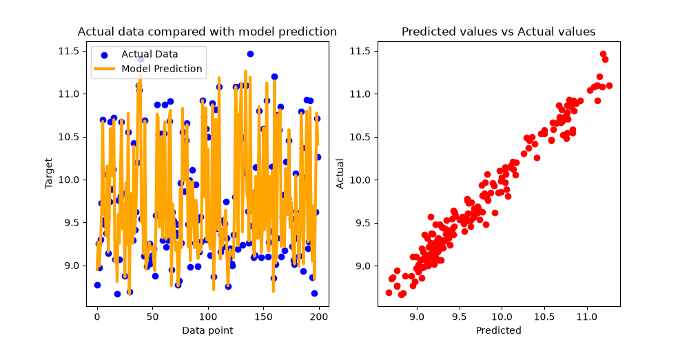

# Task One: Research and Select an AI Algorithm

The task at hand is requesting an AI algorithm that will solve an optimization problem; predict the health risk score based on measurable weather features. In this, we will research three different algorithms that could potentially solve the problem and select one. The one that will be selected will be trained and tested on the DQN1 dataset provided. The three researched algorithms are provided below.

## Algorithm One (Linear Regression)

Linear regression is an algorithm that applies Ordinary Least Squares, or mathematically speaking:

$$\min_{w} ||Xw - y||_2^2$$

This allows it to “fit a linear model with coefficients w = (w1, …, wp) to minimize the residual sum of squares between” the targets in the provided data set. To simplify, this algorithm will take a matrix of features and targets, then defines a “straight line” linear function that minimizes the error rate from said function and the targets. Given the scope of the optimization problem, instead of a traditional two-dimensional relationship between one independent variable and one dependent variable, this problem contains thirty-two features (independent variables) and one target (dependent variable). This creates a computational problem that is within a 33-dimensional space, incomprehensible to humans. Thus, with the use of computational devices, the algorithm can utilize the coined term Multiple Linear Regression which will assign weights to each of the features, hence the coefficients. It will provide a prediction in the scope of the optimization problem, providing the best possible model for future data.

## Algorithm Two (Gaussian Process Regression)

The next potential algorithm to be used is the Gaussian Process Regression algorithm. Unlike a traditional machine learning algorithm, GP algorithms will provide an entire distribution over functions instead of a single point prediction. This allows the algorithm to express uncertainty and a confidence level of prediction, providing more information for higher stakes environments. Effectively, instead of an example such as Linear Regression which assigns a fixed functional form that is governed by a set of parameters, the GP algorithm instead deviates from this parameter space and transitions into a functional space. This algorithm instead is defined by two statistical components: a mean function and a covariance function (i.e., kernel). Mathematically, this is how the function operates:

$$f(x) \sim \mathcal{GP}\left(m(x), k(x, x')\right)$$

The mean function, m(x), is a representation of the expected value of the function at any given point of x. The kernel function, k(x, x’), is what allows the GP algorithm to produce a quality model. This function defines the behavior of the functions and dictates the relationship between x and x’. By treating functions over simple parameters, the GP algorithm provides a framework that balances data driven predictions and statistical awareness.

## Algorithm Three (Decision Tree Regression)

Decision trees are a non-parametric supervised learning algorithm, meaning that the algorithm assumes the data does not follow a probability distribution. Instead of relying on continuous mathematical functions, decision trees partition all the features into a treelike structure of if/then flow statements. In other words, the algorithm will consist of a root node and continuously make binary decisions through the internal nodes to produce the outcome, i.e., the leaf nodes. This process will partition the results into subsets, instead of generalizing a linear function.

## Algorithm Selection

For this optimization problem, the algorithm of choice is the linear regression algorithm. The dataset provided has features that include NO2, CO2, and other air quality metrics combined with thermal indicators such as heat index and max temperature. The nature of the algorithm assigns weights to its features, allowing it to naturally mirror the physical logic of how these factors compound with each other.

Two strengths that this algorithm has are computational efficiency and a low variance. Linear regression only requires minimal computational power to train, test, execute, and scale, even with the 32-feature data set. In terms of low variance, linear regression forces a straight-line, or hyper-plane given the 33-dimensional space, relationship, allowing it to be more resistant to overfitting in comparison to a decision tree.

Unfortunately, the benefit of this forced straight-line relationship also has a slight drawback. Because nature can potentially have so called “tipping points,” there may be exponential thresholds that the linear model cannot represent. Another drawback is the sensitivity to multicollinearity, i.e. when two or more variables are highly correlated. Because the heat index, temperature max, a feels like are correlated based on the same underlying temperature, it is mathematically impossible to isolate which of these features has the highest or lowest impact on the health risk score.

## Test and Validate

There will be two evaluation metrics used to assess the performance of the linear regression model in this optimization problem. The first one will be the R2 score (Coefficient of Determination) which determines the proportion of variation in the target that is predictable from the features. This is done by this mathematical function:

$$R^2 = 1 - \frac{SS_{\text{res}}}{SS_{\text{tot}}}$$

This is 1 subtracted by the sum of squared residual errors divided by the total sum of squares. The R2 score is shown from 0.0 to 1.0, where 1.0 is a perfect fit and 0.0 is a baseline. The benefit of the R2 is it can also be negative, meaning the model is “arbitrarily worse,” in other words, worse than a simple guess.

The second evaluation metric will be the Mean Squared Error, which measures the accuracy of a predictive model. It does so via this function:

$$\text{MSE} = \frac{1}{n} \sum_{i=1}^{n} (y_i - \hat{y}_i)^2$$

This is computed in four parts: first, find the error, square it, penalize large errors, then calculate the average. Thus, the smaller the result, the closer the algorithm is to finding a line of best fit. This provides a “quantitative measure of accuracy of the predictive models.”

Finally, there will also be two plots that will represent the results of the algorithm: one to display the prediction overlayed with the actual targets, and another to show the comparison of the predicted values vs. actual values.

## Results

After training and testing the linear model on the DQN1 dataset, here are the results: R2 = 0.9677261528211019, MSE = 0.014645377333760565, and output tables:

From these results, it is evident that the 0.968 R2 score is close to the perfect fit of 1.0 and the 0.015 Mean Squared Error is close to zero. It is presumable that the algorithm has both a low variation and has provided line of near perfect fit. However, as seen from the plot on the left, there are noticeable outliers from which the algorithm could not predict. For example, located above datapoint 150 the blue data point is significantly higher than the orange predicted value. As noted in the linear regression drawbacks, these outliers may in fact be an example of aforementioned “tipping points” that the model is mathematically unable to represent. This represents a clear area of potential improvement that could be addressed in future iterations.

[Back to README](README.md)