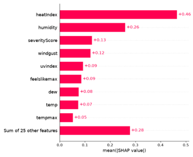
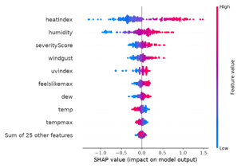
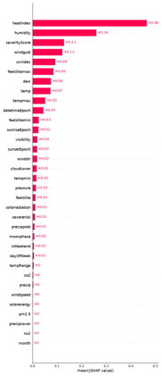

# Task Three: Exploring the data

After training a linear regression model on the DQN1 dataset, it is crucial to evaluate the significance of the features and their contribution to the health risk score.

## Data Exploration and Analysis

Out of the thirty-four features to predict health risk score, with an initial look at the data, there are three notable features that have a significant impact on the outcome. First, temperature, with a high of 99.85° and low of 55.55°, such distribution can form a notable trend that heavily influences heat stress and health risk calculations. The second notable feature is humidity with a range of 11.75% and 92.46%. A range as such, in correlation with the nature of humidity and human perspiration, can directly impact the health risk. The final feature is tempmax with a high of 107.8° and a low of 62.04°. This in correlation with the humidity has a strong influence on the health score.

Two patterns worth mentioning are the temperature and the humidity. When the maximum temperature reached above 107, the health risk score was at 10.59. When the humidity percentage is above 90 percent, the health risk score averages 9.90%. Though it is not the highest, it is still above the average of 9.73%. On the other hand, when the humidity is the lowest five percentages, the average health risk of those instances is 9.00%.

Given these relative trends, the features with the highest influence on the health risk score theoretically should be the temperature and humidity. This also coincides with body heat regulation; the elevated level of humidity does not allow the sweat on the skin to easily evaporate, hindering the ability to remove heat.

## Interpretation of Model Outputs

From the optimized model in the second portion of the overall assignments, the metrics used are aligned with regression evaluation: R2 and Mean Squared Error. The evaluated score of the best optimization technique, ridge regression, produced a result of R2 = 0.9689 and mean squared error = 0.0141. Overall, the ridge regression performs at a high accuracy with only 3.02% of the data left unexplained and to random errors. However, for future improvements, though slight, tuning parameters and feature engineering can provide such modifications to better the model.

To identify the functionality of the model, gathering the Shapley values provides a plethora of information.

One notable insight is the importance of the heat index feature over all others. This feature has a mean Shapley value of 0.46 which is nearly double the over features. This implies that the health risk score is heavily influenced by the heat index.

Another notable insight is the severity of the heat index. From this bee swarm graph above, the color of the datapoints represent the range of values (red being high, blue being low) and the placement on the x axis denotes the effect that feature has on the prediction of the model. Notice the cluster of blue data points of the heat index close to a SHAP value of zero, however, as the data point turns red, the distribution notably thins out and the SHAP value increases. This denotes that the model’s weight on that feature provides the most significant impact on the outcome of the prediction.

The final insight worth mentioning is features that are not important.

Above is a demonstration of all the mean Shapley values for this model. There are four features whose values are both zero and do not have a noticeable bar represented. Their specific Shapley values are month = 0.0, no2 = 8.643e-05, precipcover = 7.699e-5, and pm2.5 = 7.179e-4. The month feature has no influence on the model’s decision, furthermore, the other three features are effectively insignificant.

There is a lot to be inferred from this information; however, the most important is simply the value that the model has determined of the features. First, the model provides extreme importance to the heat index, humidity, and other notable features, thus, the accuracy of these metrics in future data collection is imperative. Second, a linear regression model is incapable of representing exponential growth due to its nature of fitting a straight line (for example: the sudden impact heat index has the higher the value as shown by the bee swarm graph). However, there are two caveats to this; one way is to provide an ensemble method with another model that can represent exponential growth, another by transforming features via logarithmically or polynomial transformation. Finally, the effectively insignificant features have no impact on the model’s prediction, meaning that collection of such data is meaningless for the purposes of this optimization problem. However, that is a decision that may require more testing and could provide noise to prevent overfitting.

Overall, the linear regression optimized to ridge regression is a sufficient model for this optimization problem. Any improvements will be miniscule at best, however, after reviewing the Shapley values and coefficients, as stated above, there are improvements that can be made.

[Back to README](README.md)