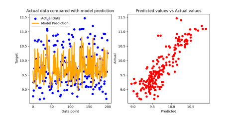
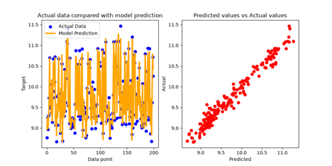
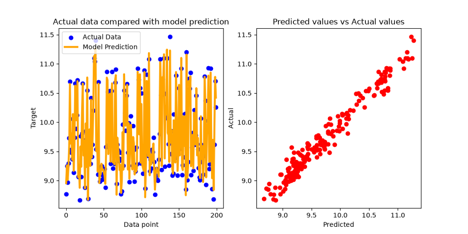

# WGU D682 Task Two

## Selection of Optimization Techniques

The two optimization techniques used are simple. Because linear regression is a model well researched and optimized, and the base model can reach an R2 score of .9677 and a Mean Squared Error of .0147, optimization would simply be fine tuning. Thus, hyperparameter tuning via RandomizedSearchCV and HalvingRandomSearchCV are used.

RandomizedSearchCV will iterate through the logarithmic scale of the ‘tol’ parameter with the Linear Regression model to determine the best possible parameter setting. This will allow for a near optimal setting of the tolerance parameter.

The other that is used is HalvingRandomSearchCV which follows a similar process to the RandomizedSearchCV; however, it is more efficient by running successful halving. The optimization technique will remove the bottom half of the underperforming candidates, allocating more resources to the stronger models.

## Selection of Regularization Methods

Two common regularization techniques used with Linear Regression are Lasso and Ridge. Lasso has the capability to estimate sparse coefficients, i.e. set coefficients to zero. The reason behind this decision is due to some seemingly not necessary features in the calculation of the target. Some of these being the simple date, potential moon phase, and whether it is the weekend or not.

Ridge regression is different in that it applies a penalty on the size of coefficients. This will prevent overfitting on the model and optimize the prediction. The difference between Ridge compared to Lasso is that instead of simply setting the coefficients of seemingly unnecessary features to zero, it instead prevents any extreme coefficients.

## Selection of Ensemble Learning Techniques

The two ensemble learning techniques that are used are AdaBoost Regression and Bagging Regression. Though the use of ensemble learning is counterproductive with linear regression, using these two techniques will demonstrate as such.

The choice of using Bagging Regression is for its ability to take a collection of base linear regressors and their predictions to provide an answer via voting or averaging them. This will allow multiple models to be trained on different subsets of the data and create a prediction.

The other choice of AdaBoost Regression is for its ability to correct specific errors that were made by previous models. However, because linear regression is a strong global model, the scoring of the model is not anticipated to show much improvement.

## Evaluation Metrics

The two evaluation metrics that will be used are the same that have been used in the previous task: R2 score and Mean Squared Error. R2 score will provide a proportion of variation from the targets; the closer the number is to 1.0, the better. Mean squared error will compute in four parts: first, find the error, square it, penalize large errors, then calculate the average; the closer to zero, the better. These two metrics will allow numerical comparison between each of the techniques and methods used above to determine the best possible improvement that can be achieved.

## Results

After successful completion of each of the techniques and methods provided, here are the results. As in any scientific method, a control must be performed. The base model can provide a R2 score of .9677 (four significant figures to show the slight differences between methods) and a Mean Squared Error of .0147. Here is the relationship between the model and data:

With the R2 score and Mean Squared Error exceptionally close to perfection, the linear regression model is adequate at sufficing the business optimization problem. However, the goal of this study is to determine if there is a method that can improve the model more ever so slightly. To start, here are the results of the optimization techniques:

**Optimization Techniques:**

The RandomSearchCV (“CV” meaning cross validation) performs at a R2 score of .9685 and a mean squared error of .0147. Slightly better performance compared to the control.

The HalvingRandomSearchCV performs an R2 score of .9685 and a mean squared error of .0143. These are relatively the same as Random Search, however, the mean squared error is slightly better.

Out of these two optimization techniques, the better solution is the Halving Random Search not only due to the slightly better performance, but also due to the functionality of generating and cross validating models.

**Regularization Methods:**

The Lasso Regression method resulted in an R2 score of .6874 and a Mean Squared Error of .1418; to say the least, exceptionally worse.

The Ridge Regression method resulted in an R2 score of .9688 and a Mean Squared Error of .0141, outperforming the previous three techniques/methods, and the base model.

**Ensemble Techniques:**

As mentioned above, ensemble techniques are counterproductive for the model due to linear regression being a strong stable learner. Ensemble techniques are intended to combine multiple weak learning models to strengthen and improve overall accuracy. To represent these counterproductivities, the Bagging Ensemble technique produces and R2 score of .9665 and a mean squared error of .0152.

The AdaBoost Ensemble technique produced an R2 score of .9657 and a mean squared error of .0155.

To summarize, the Bagging Ensemble and AdaBoost Ensemble techniques did not show improvement from the base model.

**Performance Comparison:**

| Methods/Techniques          | R2 Score | Mean Squared Error |
|-----------------------------|----------|--------------------|
| Linear Regression (Control) | .9677    | .0147              |
| Random Search               | .9685    | .0143              |
| Halving Random Search       | .9685    | .0143              |
| Lasso Regression            | .6874    | .1418              |
| Ridge Regression            | .9688    | .0141              |
| Bagging Ensemble            | .9665    | .0152              |
| AdaBoost Ensemble           | .9657    | .0155              |

Notably, the best performing method/technique is Ridge Regression regularization technique. Though the score is only better by a factor of one thousandth, it still outperforms the others. Notable, because a linear regression model is a strong stable learner, optimization techniques will only provide small improvements. For the purpose of a business study, ridge regression will be the best possible solution to model weather data off of to provide a predictive health score.

[Back to README](README.md)